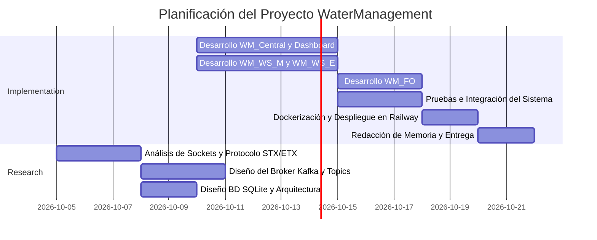

```mermaid
gantt
    title Planificación del Proyecto WaterManagement
    dateFormat  YYYY-MM-DD
    
    section Implementation
    Desarrollo WM_Central y Dashboard         :imp1, 2026-10-10, 5d
    Desarrollo WM_WS_M y WM_WS_E              :imp2, 2026-10-10, 5d
    Desarrollo WM_FO                          :imp3, after imp1, 3d
    Pruebas e Integración del Sistema        :imp4, after imp2, 3d
    Dockerización y Despliegue en Railway     :imp5, after imp4, 2d
    Redacción de Memoria y Entrega            :imp6, after imp5, 2d

    section Research
    Análisis de Sockets y Protocolo STX/ETX :res1, 2026-10-05, 3d
    Diseño del Broker Kafka y Topics          :res2, after res1, 3d
    Diseño BD SQLite y Arquitectura           :res3, after res1, 2d
```
