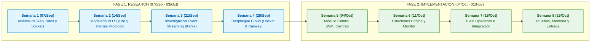

```mermaid
graph LR
    classDef research fill:#e1f5fe,stroke:#0288d1,stroke-width:2px,color:#01579b;
    classDef impl fill:#e8f5e9,stroke:#388e3c,stroke-width:2px,color:#1b5e20;

    subgraph FASE1["FASE 1: RESEARCH (07/Sep - 03/Oct)"]
        A["<b>Semana 1 (07/Sep)</b><br>Análisis de Requisitos y Sockets"]:::research --> B["<b>Semana 2 (14/Sep)</b><br>Modelado BD SQLite y Tramas Protocolo"]:::research
        B --> C["<b>Semana 3 (21/Sep)</b><br>Investigación Event Streaming (Kafka)"]:::research
        C --> D["<b>Semana 4 (28/Sep)</b><br>Despliegue Cloud (Docker & Railway)"]:::research
    end

    subgraph FASE2["FASE 2: IMPLEMENTACIÓN (04/Oct - 01/Nov)"]
        E["<b>Semana 5 (04/Oct)</b><br>Módulo Central (WM_Central)"]:::impl --> F["<b>Semana 6 (11/Oct)</b><br>Estaciones Engine y Monitor"]:::impl
        F --> G["<b>Semana 7 (18/Oct)</b><br>Field Operators e Integración"]:::impl
        G --> H["<b>Semana 8 (25/Oct)</b><br>Pruebas, Memoria y Entrega"]:::impl
    end

    D --> E
```
